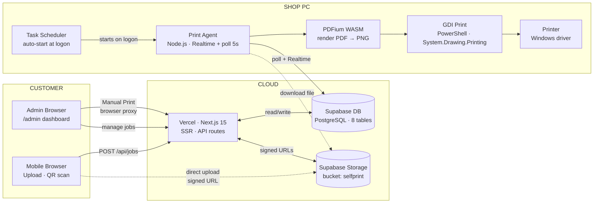
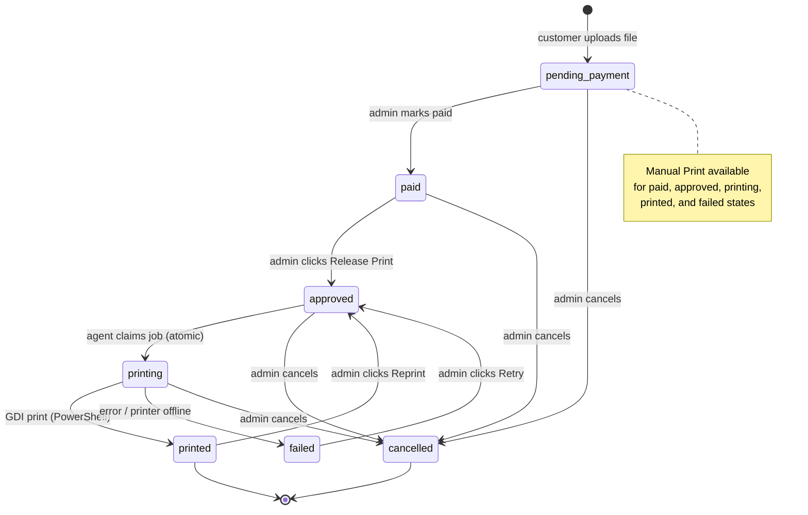

# Self_Print

A QR-friendly self-service print queue for Xerox shops. Customers scan a QR code, upload files using their own mobile data, select print settings, receive a token, pay at the counter, and staff release the job from the admin dashboard. A Windows agent on the shop PC polls approved jobs and sends them to the selected printer.

## Quick Start

### 1. Start the web app

```powershell
npm install
npm run db:seed
npm run dev
```

Customer URL: `http://localhost:3000/`
Admin URL: `http://localhost:3000/admin`

### 2. Start the print agent (on shop PC)

Ensure `agent/config.json` is configured. Then run:

```powershell
.\START-PRINTER.bat
```

See **[Windows Scripts](#windows-scripts)** section for all available `.bat` / `.vbs` files.

---

## Setup

### Environment

Create a `.env` file:

**SQLite mode (default, local):**
```env
AGENT_TOKEN=change-me-to-a-random-secret
```

**Supabase mode (cloud/production):**
```env
AGENT_TOKEN=change-me-to-a-random-secret
SUPABASE_URL=https://your-project.supabase.co
SUPABASE_SERVICE_ROLE_KEY=your-service-role-key

# (Optional, highly recommended for production performance)
# Direct Client-to-Supabase uploads (bypasses Vercel upload double-hop)
NEXT_PUBLIC_SUPABASE_URL=https://your-project.supabase.co
NEXT_PUBLIC_SUPABASE_ANON_KEY=your-anon-key
```

Supabase mode activates automatically when both `SUPABASE_URL` and `SUPABASE_SERVICE_ROLE_KEY` are set; otherwise the app falls back to local SQLite. There is no separate toggle flag.

When `NEXT_PUBLIC_SUPABASE_URL` and `NEXT_PUBLIC_SUPABASE_ANON_KEY` are provided, the browser uploads files **directly to Supabase Storage**, bypassing the Vercel server proxy (faster, and avoids Vercel's request body limit). It uses **signed upload URLs**: the browser first calls `POST /api/uploads/sign`, the server validates the file and returns a short-lived upload token bound to a server-chosen path, then the browser uploads with that token. The Storage bucket stays **private** — no anonymous insert policy is required.

> **Security:** `SUPABASE_SERVICE_ROLE_KEY` bypasses RLS and has full DB access. Use it server-side only — never expose it to the browser or commit it. The print agent (`agent/config.json`) also uses a service-role key; keep that file out of version control. The browser only ever holds the `anon` public key, and uploads are authorized per-file by a server-issued signed token.

Everything else uses safe defaults. Admin login: `admin` / `1234`

### Supabase Setup

1. Create a project at [supabase.com](https://supabase.com)
2. Run the following SQL in the **Supabase SQL Editor** to create all tables and seed defaults:

```sql
CREATE TABLE public.jobs (
  id TEXT PRIMARY KEY,
  token TEXT NOT NULL UNIQUE,
  status TEXT NOT NULL,
  print_type TEXT NOT NULL,
  copies INTEGER NOT NULL,
  page_range TEXT,
  paper_size TEXT NOT NULL,
  layout TEXT NOT NULL DEFAULT 'portrait',
  pages_per_sheet INTEGER NOT NULL DEFAULT 1,
  margins TEXT NOT NULL DEFAULT 'default',
  scale TEXT NOT NULL DEFAULT 'default',
  page_count INTEGER NOT NULL,
  price_paise INTEGER NOT NULL,
  needs_conversion INTEGER NOT NULL DEFAULT 0,
  queue_position INTEGER NOT NULL DEFAULT 0,
  created_at TEXT NOT NULL,
  updated_at TEXT NOT NULL,
  paid_at TEXT,
  printed_at TEXT
);

CREATE TABLE public.job_files (
  id TEXT PRIMARY KEY,
  job_id TEXT NOT NULL REFERENCES public.jobs(id) ON DELETE CASCADE,
  original_name TEXT NOT NULL,
  stored_name TEXT NOT NULL,
  mime_type TEXT NOT NULL,
  size_bytes INTEGER NOT NULL,
  file_kind TEXT NOT NULL,
  storage_path TEXT NOT NULL,
  created_at TEXT NOT NULL
);

CREATE TABLE public.pricing_config (
  id INTEGER PRIMARY KEY CHECK (id = 1),
  bw_per_page_paise INTEGER NOT NULL DEFAULT 150,
  color_per_page_paise INTEGER NOT NULL DEFAULT 500,
  photo_print_paise INTEGER NOT NULL DEFAULT 1000,
  copy_multiplier REAL NOT NULL DEFAULT 1.0,
  a4_multiplier REAL NOT NULL DEFAULT 1.0,
  legal_multiplier REAL NOT NULL DEFAULT 1.2,
  photo_multiplier REAL NOT NULL DEFAULT 2.0,
  expiry_minutes INTEGER NOT NULL DEFAULT 1440,
  updated_at TEXT NOT NULL DEFAULT now()::text
);

CREATE TABLE public.admin_users (
  id TEXT PRIMARY KEY,
  username TEXT NOT NULL UNIQUE,
  password_hash TEXT NOT NULL,
  role TEXT NOT NULL DEFAULT 'admin',
  created_at TEXT NOT NULL
);

CREATE TABLE public.agent_tokens (
  id TEXT PRIMARY KEY,
  token TEXT NOT NULL UNIQUE,
  name TEXT,
  created_at TEXT NOT NULL
);

CREATE TABLE public.print_events (
  id TEXT PRIMARY KEY,
  job_id TEXT NOT NULL REFERENCES public.jobs(id) ON DELETE CASCADE,
  printer_name TEXT,
  event_type TEXT NOT NULL,
  message TEXT,
  created_at TEXT NOT NULL
);

CREATE TABLE public.agent_config (
  id INTEGER PRIMARY KEY CHECK (id = 1),
  printer_name TEXT NOT NULL DEFAULT '',
  updated_at TEXT NOT NULL DEFAULT now()::text
);

CREATE TABLE public.agent_printers (
  id TEXT PRIMARY KEY,
  name TEXT NOT NULL,
  status TEXT NOT NULL DEFAULT 'online',
  location TEXT,
  updated_at TEXT NOT NULL
);

-- Seed defaults
INSERT INTO public.pricing_config (id, bw_per_page_paise, color_per_page_paise, photo_print_paise, copy_multiplier, a4_multiplier, legal_multiplier, photo_multiplier, expiry_minutes, updated_at)
VALUES (1, 150, 500, 1000, 1.0, 1.0, 1.2, 2.0, 1440, now()::text);

INSERT INTO public.agent_config (id, printer_name, updated_at)
VALUES (1, '', now()::text);

-- Default agent token (replace with your own; value must match AGENT_TOKEN env var)
INSERT INTO public.agent_tokens (id, token, name, created_at)
VALUES (gen_random_uuid()::text, 'change-me-to-a-random-secret', 'Default Agent', now()::text);
```

> **Admin user:** For Supabase, insert manually with the correct PBKDF2 hash — see `hashSecret` in `src/lib/security.ts`. Default credentials: `admin` / `1234`.
4. **Enable RLS** on all 8 tables. The web app and print agent both connect with the service-role key, which bypasses RLS, so a deny-all (RLS on, no policies) state is safe and blocks all anon-key access:

```sql
ALTER TABLE public.jobs ENABLE ROW LEVEL SECURITY;
ALTER TABLE public.job_files ENABLE ROW LEVEL SECURITY;
ALTER TABLE public.pricing_config ENABLE ROW LEVEL SECURITY;
ALTER TABLE public.agent_config ENABLE ROW LEVEL SECURITY;
ALTER TABLE public.agent_printers ENABLE ROW LEVEL SECURITY;
ALTER TABLE public.admin_users ENABLE ROW LEVEL SECURITY;
ALTER TABLE public.agent_tokens ENABLE ROW LEVEL SECURITY;
ALTER TABLE public.print_events ENABLE ROW LEVEL SECURITY;
```

5. Add covering indexes for the foreign keys and agent-poll query (performance). `jobs.token` is already indexed by its `UNIQUE` constraint:

```sql
CREATE INDEX idx_job_files_job_id ON public.job_files(job_id);
CREATE INDEX idx_print_events_job_id ON public.print_events(job_id);
CREATE INDEX idx_jobs_approved ON public.jobs(status, needs_conversion, updated_at);
```

6. **Storage bucket (`selfprint`) — keep it private.** Direct uploads use server-issued signed upload URLs, so **no anonymous insert policy is needed**. Lock the bucket down instead:

   ```sql
   UPDATE storage.buckets
   SET public = false,
       file_size_limit = 26214400,  -- 25 MB
       allowed_mime_types = ARRAY[
         'application/pdf','image/jpeg','image/png',
         'application/msword',
         'application/vnd.openxmlformats-officedocument.wordprocessingml.document'
       ]
   WHERE id = 'selfprint';
   ```

   Reads (admin preview, agent download) are served via short-lived signed URLs minted server-side with the service-role key. No `storage.objects` policies are required because all access goes through the service role.

### Print Agent

The Print Agent is a Node.js process that runs on the shop's Windows PC. It listens for print commands in real time via Supabase Realtime, downloads the PDF file, renders it page-by-page to PNGs using PDFium WASM, and prints them silently using standard Windows GDI printing via PowerShell.

#### 1. Setup Requirements
The agent runs self-contained out-of-the-box. There is no need to install external PDF viewers (like SumatraPDF or Acrobat Reader). All dependencies are handled automatically by `npm install`.

#### 2. Create and Configure `agent/config.json`
Copy `agent/config.example.json` to `agent/config.json` and fill in your Supabase project settings:

```json
{
  "supabaseUrl": "https://your-project.supabase.co",
  "supabaseKey": "your-service-role-key",
  "tempDir": "./agent-temp",
  "maxRetries": 3,
  "fallbackPrinter": "Your Printer Name"
}
```

* **`supabaseUrl`**: Your project URL from the Supabase dashboard (Settings -> API).
* **`supabaseKey`**: Your service role key (`service_role` / `secret` key) from Supabase API settings. *(Must be the service role key, not the anon key).*
* **`fallbackPrinter`**: (Optional) The name of the printer to use if no printer is selected on the admin dashboard.

#### 3. Run the Agent

See **[Windows Scripts](#windows-scripts)** below for all `.bat` / `.vbs` launchers and auto-start setup.

Once running, the agent automatically detects all installed Windows printers and reports them to the database so you can choose which printer to use in the Admin dashboard.

---

## Windows Scripts

All `.bat` and `.vbs` files live in the project root. Keep them together — they reference each other by relative path.

| File | Purpose | When to use |
|---|---|---|
| `START-PRINTER.bat` | Starts agent in a visible window; auto-restarts on crash | Daily testing / monitoring |
| `START-PRINTER-BACKGROUND.vbs` | Starts agent silently (no visible window) | Production / auto-start |
| `INSTALL-AUTOSTART.bat` | Registers a Windows Scheduled Task (`SelfPrintAgent`) that runs the agent at every logon | **Once only** during setup |
| `TEST-PRINTER.bat` | Lists all printers on the PC and sends a test page | Setup / troubleshooting |
| `STOP-DEV-AGENT.bat` | Kills any SelfPrint agent process running on this machine | Dev box only — stops it stealing jobs meant for the shop PC |
| `agent\start-agent.bat` | Minimal auto-restart launcher inside the agent folder | Alternative to root `START-PRINTER.bat` |

### Auto-Start Setup (one time)

1. Double-click **`INSTALL-AUTOSTART.bat`** → approve the UAC prompt.
2. Done. The agent now starts silently at every Windows logon.
   - Task name: `SelfPrintAgent`
   - Trigger: At Logon
   - Auto-restarts every 1 minute on crash
3. **Optional — fully hands-free after power cut:** enable Windows auto-login so the scheduled task fires without anyone typing a password.

   Via GUI: `Win+R` → `netplwiz` → uncheck *Users must enter a username and password* → enter password.

   Via PowerShell (run as Administrator):
   ```powershell
   $reg = "HKLM:\SOFTWARE\Microsoft\Windows NT\CurrentVersion\Winlogon"
   Set-ItemProperty $reg "AutoAdminLogon"  "1"
   Set-ItemProperty $reg "DefaultUsername" "YourWindowsUsername"
   Set-ItemProperty $reg "DefaultPassword" "YourWindowsPassword"
   ```

To remove auto-start:
```powershell
Unregister-ScheduledTask -TaskName "SelfPrintAgent" -Confirm:$false
```

---

## Printing Flow & Retry Handling

1. **Customer Upload**: Customer uploads a file and receives a token number and queue position.
2. **Counter Payment**: Admin finds the token, collects payment, and clicks **Mark Paid**.
3. **Release Print**: Admin clicks **Release Print** which updates the status to `approved`.
4. **Agent Processing**: The Windows print agent polls (or receives Realtime push) for approved jobs, claims the job atomically, downloads the PDF file, rasterizes it page-by-page using **PDFium WASM**, and sends each page to the Windows printer via **GDI print (PowerShell)**.
5. **Mark Done**: Agent updates status to `printed` (done).

### Retry / Error Handling
* **Transient Failures**: If a job fails due to printer errors, network drops, or download issues, the agent marks the job status as `failed` and logs the error in the `print_events` table.
* **One-Click Retry**: Admins can retry any failed job. Click **Retry** on the Admin Dashboard queue card or **Retry Print** in the Job Detail page. This queues it back into the queue with `approved` status so the agent prints it again immediately.
* **Reprint**: Already-printed jobs can also be queued again via the **Reprint** button, setting them back to `approved`.

### Manual Print (Fallback)

If the print agent is down or **Release Print** does not work, admins can print directly from the browser:

1. Admin dashboard → click job → **Manual Print** button.
2. The file is fetched via a same-origin proxy (`/api/uploads/[id]?proxy=1`), avoiding CORS issues.
3. A browser preview frame loads the file, and the job's print settings (copies, pages, color, paper size, layout) are displayed.
4. Click **Print** → native Windows print dialog opens.
5. Manually apply the displayed settings in the dialog (they are not applied automatically).
6. Select printer → Print.

> Works from any browser — the operator can use a phone or counter PC. DOC/DOCX jobs must be converted to PDF first. Manual Print is available for jobs in `paid`, `approved`, `printing`, `printed`, or `failed` status.

---

## Architecture

### System Overview



### Job Lifecycle



**Database:** Dual-mode — SQLite (`better-sqlite3`) for local/dev, Supabase (PostgreSQL) for production. Auto-selected by presence of `SUPABASE_URL` + `SUPABASE_SERVICE_ROLE_KEY` (no toggle flag). Both share the same schema and query interface via `src/lib/db.ts` / `src/lib/db-supabase.ts`.

**Storage:** Local filesystem for dev; private Supabase Storage bucket for production. Uploads go direct from the browser via signed upload URLs; reads use short-lived signed download URLs. Object paths are server-controlled.

**Auth:**
- Admin: session-based (cookie), `admin_users` table
- Agent: bearer token, hashed in `agent_tokens` table
- Customers: no auth required

**File storage:**
- Originals: `uploads/originals/`
- Converted: `uploads/converted/`
- Agent temp: `agent-temp/`

**Tables:** `jobs`, `job_files`, `pricing_config`, `admin_users`, `agent_tokens`, `agent_config`, `agent_printers`, `print_events`

---

## Features

- **Customer upload** — PDF, JPG, PNG, DOC/DOCX support via mobile
- **Print settings** — B/W or color, copies, page range, paper size (A4/A5/A3/B5/Letter/Legal/Photo), layout, scale
- **Live admin dashboard** — SSE updates, expiry countdown, queue position, status badges
- **Printer selection** — choose active printer from admin dashboard, agent fetches it automatically
- **Batch actions** — select multiple jobs and mark paid in one click
- **Pricing config** — B/W/color rates, paper size multipliers, job expiry time
- **Job editing** — change copies, pages, paper size, layout, margins, pages-per-sheet before release (locked when printing)
- **DOC/DOCX conversion** — auto-converted to PDF via LibreOffice (`npm run convert` or the admin convert endpoint); page count and price recomputed
- **Auto cleanup** — finished and expired-unpaid jobs (plus their files) removed on a schedule


## Commands

```powershell
npm run dev        # Start development server
npm run build      # Build for production
npm run start      # Start production server
npm run typecheck  # Type check only
npm run db:seed    # Initialize/seed local SQLite database
npm run cleanup    # Delete finished + expired jobs and their files
npm run convert    # Convert pending DOC/DOCX uploads to PDF (needs LibreOffice)

npm run agent      # Start print agent (connects to Supabase)
```

---

## Default Values

| | Value |
|---|---|
| Admin | `admin` / `1234` (change after first login) |
| Agent token | set via `AGENT_TOKEN` env var |
| B/W per page | ₹2 |
| Color per page | ₹10 |
| Job expiry | 24 hours |

Pricing is configurable from the admin dashboard Settings panel.

---

## DOC/DOCX Conversion

DOC/DOCX uploads are stored with `needs_conversion = 1` and cannot be released until converted to PDF. Conversion uses **LibreOffice headless**.

1. Install LibreOffice on the machine running the web app (or set `LIBREOFFICE_PATH` to `soffice(.exe)`).
2. Convert pending documents:
   - **Batch script:** `npm run convert` — processes every pending DOC/DOCX.
   - **On demand:** `POST /api/admin/jobs/<id>/convert` (admin session) — converts one job.

Conversion replaces the stored file with the PDF, deletes the original, and recomputes page count and price. The print agent still applies the job's paper size/scale at print time.

## Maintenance / Cleanup

`cleanupOldJobs` removes finished jobs (`printed`/`cancelled`/`failed`) and unpaid jobs older than the configured expiry, along with their stored files.

- **Manual:** `npm run cleanup`
- **HTTP:** `GET`/`POST /api/cleanup` — protected by `CRON_SECRET` (falls back to `AGENT_TOKEN`). Send `Authorization: Bearer <secret>` or `?key=<secret>`.
- **Vercel Cron:** `vercel.json` schedules `/api/cleanup` daily at 03:00. Set `CRON_SECRET` in the project env so Vercel's cron requests authenticate.
- **Self-hosted/shop PC:** schedule `npm run cleanup` (and `npm run convert`) via Windows Task Scheduler / cron.

## Optional Environment Variables

| Var | Purpose |
|---|---|
| `SHOP_UPI_ID` | Shop's UPI ID (e.g. `yourshop@upi`) — enables UPI QR + pay button on customer token screen |
| `SHOP_NAME` | Shop display name shown in UPI payment (default: `Print Shop`) |
| `LIBREOFFICE_PATH` | Path to `soffice(.exe)` if not auto-detected |
| `CRON_SECRET` | Bearer secret for `/api/cleanup` (required in production) |
| `MAX_UPLOAD_MB` | Upload size limit (default 25) |
| `SESSION_SECRET` | Admin session signing secret (set in production) |

## Known Limitations

- **No admin pagination UI**: the API supports `?page=` / `?limit=` (default 100 newest, batched file fetch — no longer loads the whole table), but the dashboard currently renders the first page only.
- **File serve**: no rate limiting on `/uploads/[id]`. Do not expose directly to the public internet without a reverse proxy.
