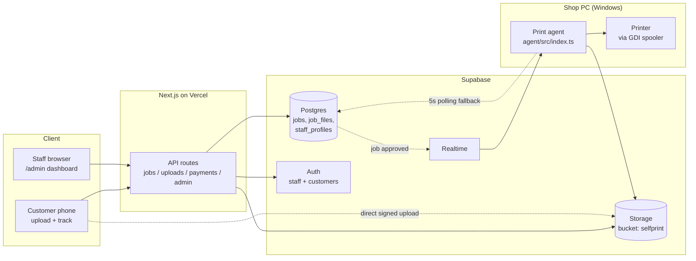
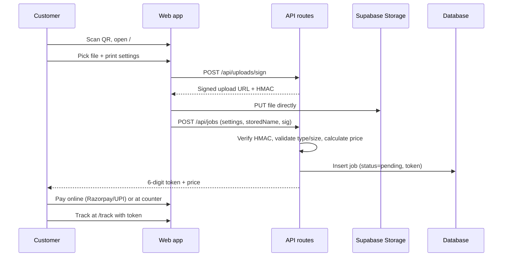
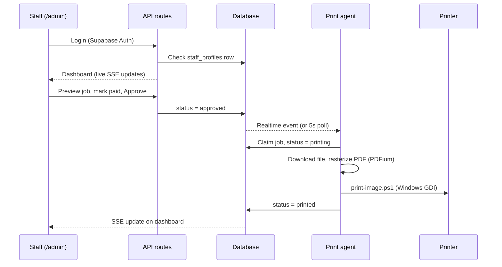
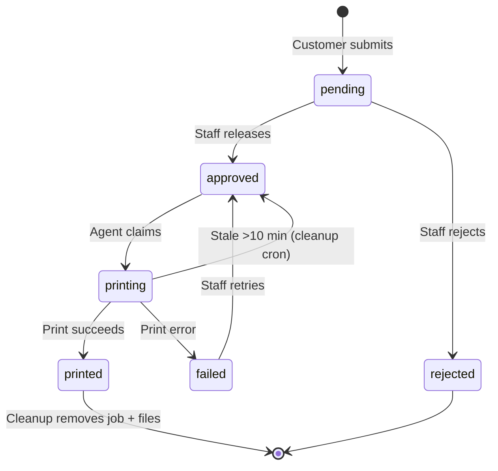
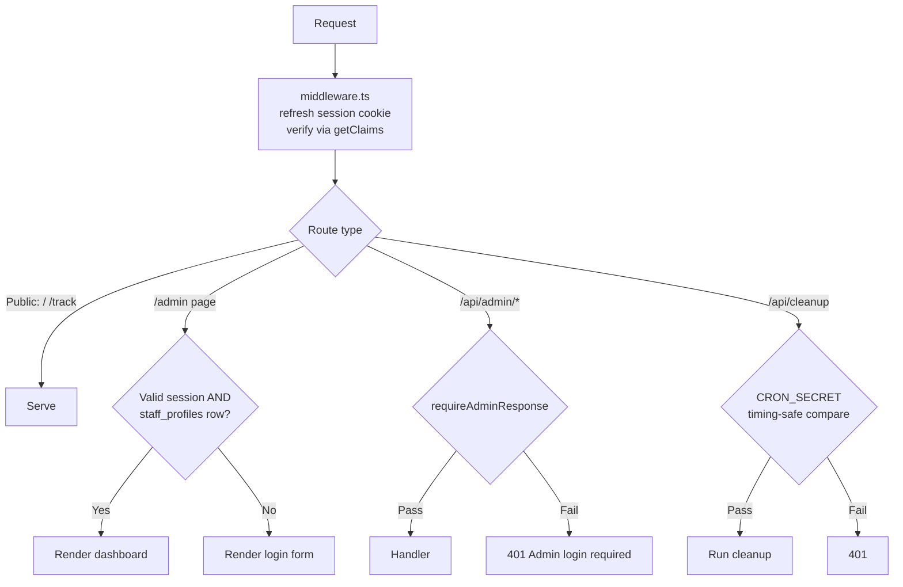

# Self_Print

QR-friendly self-service print queue for Xerox shops. Customers scan a QR code, upload files from their phone, select print settings, get a token, pay at the counter, and staff release jobs from an admin dashboard. A Windows agent polls approved jobs and prints via the system spooler.

## Quick Start

```powershell
npm install
npm run db:seed
npm run dev
```

| URL | For | What |
|---|---|---|
| `/` | Customer | Upload files (single or 2-10 PDF batch) and configure print settings |
| `/login` / `/register` | Customer | Optional account — guests can upload without one |
| `/account` | Customer | Profile editor (name, avatar) |
| `/my-jobs` | Customer | Past orders (requires login) |
| `/track` | Customer | Track an order by token |
| `/admin` | Staff | Login and live job dashboard |
| `/admin/orders` | Staff | Order management with filters and search |
| `/admin/customers` | Staff | Customer directory with order history and CSV export |
| `/admin/accounts` | Staff | Customer account administration |
| `/admin/staff` | Staff | Staff invitations and role management |
| `/admin/security` | Staff | Login events and security review |

## How It Works

### System Architecture



### Customer Order Flow



### Staff & Print Flow



### Job Status Lifecycle



Payment is tracked independently of status: `paidAt` is the single source of truth, so a job can print before or after payment.

### Auth & Access Control



Staff accounts are invite-only — there is no self-service path into `staff_profiles`. Destructive staff-management routes additionally require `role = 'super_admin'`.

## Commands

```powershell
npm run dev        # Start dev server
npm run build      # Build for production
npm run typecheck  # Type check
npm run test       # Run tests
npm run db:seed    # Seed SQLite database
npm run cleanup    # Remove finished + expired jobs
npm run convert    # Convert DOC/DOCX to PDF (needs LibreOffice)
npm run agent      # Start Windows print agent
```

## Setup

### Environment

Copy `.env.example` to `.env` and fill in what you need. Key variables:

| Variable | Required | Purpose |
|---|---|---|
| `AGENT_TOKEN` | Yes | Shared secret; protects `/api/cleanup` in dev when `CRON_SECRET` is unset |
| `SUPABASE_URL` + `SUPABASE_SERVICE_ROLE_KEY` | Production | Switches the app from local SQLite to Supabase (Postgres + Storage) |
| `NEXT_PUBLIC_SUPABASE_URL` + `NEXT_PUBLIC_SUPABASE_ANON_KEY` | For login | Supabase Auth for staff + customer accounts |
| `NEXT_PUBLIC_SITE_URL` | Production | Canonical base URL for auth emails (falls back to Vercel URL) |
| `SHOP_UPI_ID` / `SHOP_UPI_QR` + `SHOP_NAME` | Optional | UPI QR payment on the token screen (`SHOP_UPI_QR` for merchant stickers) |
| `RAZORPAY_KEY_ID` + `RAZORPAY_KEY_SECRET` (+ `RAZORPAY_WEBHOOK_SECRET`) | Optional | Razorpay checkout with auto payment confirmation |
| `CRON_SECRET` | Production | Protects the cleanup cron endpoint |
| `MAX_UPLOAD_MB` | Optional | Per-file upload cap (default 50) |

Without Supabase env vars, the app runs on local SQLite — guest upload works, login is unavailable.

### Staff Accounts

Staff are invite-only. Create the first super admin manually:

1. Supabase Dashboard → Authentication → Add user
2. Insert a matching row in `staff_profiles` with `role = 'super_admin'`

Existing admins can invite more staff from the dashboard.

### Print Agent

Copy `agent/config.example.json` to `agent/config.json` and configure:

```json
{
  "supabaseUrl": "https://your-project.supabase.co",
  "supabaseKey": "your-service-role-key",
  "fallbackPrinter": "Your Printer Name"
}
```

Run `.\agent\START-PRINTER.bat`. For auto-start on boot, run `agent\INSTALL-AUTOSTART.bat` once.

## Features

- Upload PDF, JPG, PNG, DOC/DOCX via mobile data
- Print settings: B/W or color, copies, page range, paper size, layout, scale, duplex, pages-per-sheet
- Optional customer accounts with order history
- Invite-only staff accounts (super admin / admin)
- Live admin dashboard with SSE updates
- Printer selection, batch payment mark, configurable pricing
- Home delivery as an alternative to counter pickup
- DOC/DOCX to PDF conversion via LibreOffice
- Auto-cleanup of finished and expired jobs
