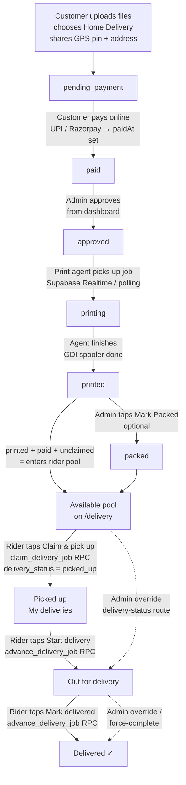

# Delivery Rider Guide

How the SelfPrint delivery role works — for shop owners setting up riders and for the riders themselves.

## For the Shop Owner (Super Admin)

### Create a rider account

1. Log in at `/admin` as an owner (super admin).
2. Go to **Staff** → **Add staff**.
3. Either **Invite** by email or **Create account** directly (email + password).
4. Set **Access level** to **Delivery**.

Riders cannot see pricing, file previews, customer management, or the admin job queue — only delivery orders. They cannot be promoted from the staff list; to change a rider's access, use the role-change API or recreate the account.

### When does an order reach riders?

An order appears in the riders' **Available** pool only when **all** of these are true:

| Condition | Meaning |
|---|---|
| Delivery method = delivery | Customer chose home delivery at upload |
| Status = printed | The print agent finished printing it |
| Paid | Payment recorded (`paidAt` set) — no cash-on-delivery flow |
| Unclaimed | No rider has taken it yet |

### Overrides

Admins keep full control via the dashboard's existing delivery-status controls (`/api/admin/jobs/[id]/delivery-status`): force an order out for delivery or mark it delivered regardless of who claimed it — use this to fix a stuck or misclaimed order. Admins can also complete any claimed order (the RPC allows admin override).

## For the Rider

### Logging in

1. Open the shop's site and go to **`/admin`** (or directly **`/delivery`**).
2. Sign in with the email and password the shop owner gave you.
3. You land on the **Deliveries** dashboard automatically (delivery accounts are redirected away from the admin panel).

### The dashboard (`/delivery`)

Two sections:

- **My deliveries** — orders you have claimed and are currently carrying.
- **Available** — paid, printed delivery orders nobody has claimed yet, oldest first.

Each order card shows: token, amount, customer name, delivery address, page/copy count, and three action chips:

- **Call** — dials the customer.
- **Navigate** — opens Google Maps turn-by-turn directions. When the customer shared a GPS pin at upload, directions target the exact pin; otherwise the written address is used.
- **View pin** — shows the customer's exact location pin on the map (only when a pin was shared).

When a GPS pin exists the card shows an **"Exact GPS pin"** badge with its accuracy (e.g. `±12 m`) and when it was shared — trust the pin over the written address; it was captured on the customer's own phone.

The list updates live — when another rider claims an order it disappears from your Available list within seconds (plus a 15-second refresh fallback).

### Claiming an order

Tap **Claim** on an Available card. The order moves to **My deliveries**.

- Claiming is first-come-first-served and race-safe: if another rider tapped Claim a moment earlier, you get "Another rider already claimed this order." — pick a different one.
- The claim is atomic in the database; two riders can never hold the same order.

### Delivering

1. Use the phone link to call the customer if needed.
2. Use **Open in Maps** to navigate to the pin, or read the written address.
3. All delivery orders are **already paid online** — never collect money at the door.
4. Hand over the prints, then tap **Mark delivered**. The order disappears from your list and the shop dashboard shows it as delivered.

Only you (or an admin) can complete an order you claimed — "You did not claim this order." means it belongs to another rider.

### If something goes wrong

- **Customer unreachable / wrong address** — call the shop; an admin can correct or re-dispatch the order from the dashboard.
- **Claimed by mistake** — tell an admin; there is no self-unclaim, but an admin can reset the order's delivery status.
- **App shows stale orders** — pull-to-refresh / reload the page; the list also self-refreshes every 15 seconds.

## Order Flow — Who Updates What, When

Full lifecycle of a delivery order, from upload to handover:

Update sources at each step:

| Step | Status change | Who / what updates it | Rider sees |
|---|---|---|---|
| Upload | job created, `pending_payment` | Customer via upload form | nothing yet |
| Payment | `paidAt` set (`paid`) | Payment webhook / admin marks paid at counter | nothing yet |
| Approval | `approved` | Admin dashboard release action | nothing yet |
| Printing | `printing` → `printed` | Windows print agent (automatic) | order appears in **Available** the moment it's `printed` + paid |
| Packing | `delivery_status = packed` | Admin taps **Mark Packed** (optional) | card stepper shows Packed; order stays claimable |
| Claim / pickup | `delivery_status = picked_up`, `delivery_person_id = rider` | Rider taps **Claim & pick up** (atomic RPC) | moves to **My deliveries**; vanishes from other riders' pool within ~10s (polling) |
| Dispatch | `delivery_status = out_for_delivery` | Rider taps **Start delivery** (owner-checked RPC) | stepper advances; customer sees "Out for delivery" |
| Handover | `delivery_status = delivered` | Rider taps **Mark delivered** (owner-checked RPC) | disappears from dashboard; admin sees Delivered |

Live updates: rider dashboards poll `/api/delivery/jobs` every 10 seconds and the admin dashboard polls every 15 seconds. SSE was removed to cut Vercel runtime cost (see `docs/VERCEL_MEMORY_RUNBOOK.md`); pool/queue changes can take up to ~10s to appear. Each transition is also logged to `print_events` for the audit trail.

Customer side: the customer tracking page (`/track`) shows the same journey as a 7-step timeline for delivery orders — Uploaded → Approved → Printed → Packed → Picked up → Out for delivery → Delivered — driven by the same status fields, polling every 5 s until delivered.

## Technical Reference

| Surface | Path |
|---|---|
| Rider dashboard | `/delivery` (`src/app/delivery/page.tsx`) |
| Pool + my orders API | `GET /api/delivery/jobs` |
| Claim | `POST /api/delivery/jobs/[id]/claim` (409 if already claimed) |
| Complete | `POST /api/delivery/jobs/[id]/delivered` (403 if not owner, unless admin) |
| DB migration | `supabase/migrations/20260728000000_add_delivery_role.sql` |

Security model: riders authenticate through the same Supabase Auth as admins but with `staff_profiles.role = 'delivery'`. `requireAdmin` rejects that role, so admin APIs are closed to riders. Claim/complete go through `security definer` RPCs (`claim_delivery_job`, `complete_delivery_job`) so riders can only ever touch `delivery_status`/`delivery_person_id`, never price, files, or print status. The rider API returns a narrow `DeliveryOrderView` — file paths and pricing breakdown never reach the rider's browser.

Design spec: `docs/superpowers/specs/2026-07-27-delivery-man-role-design.md`.
